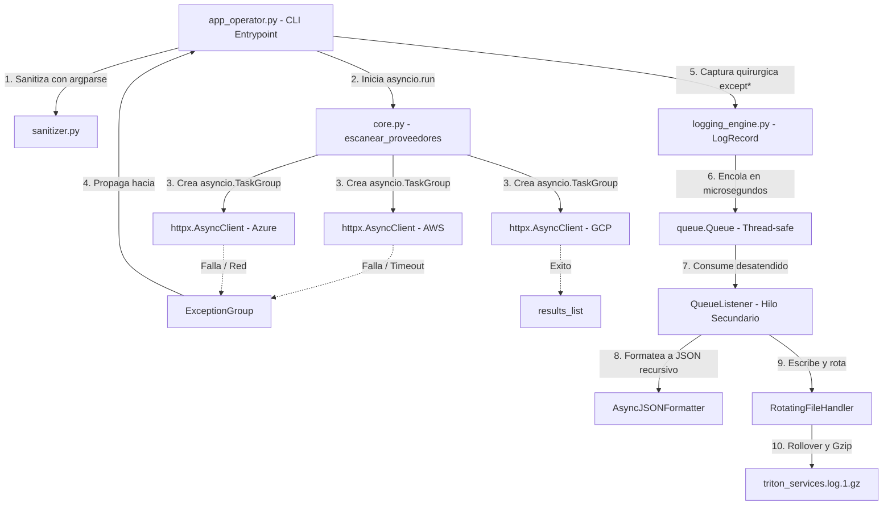
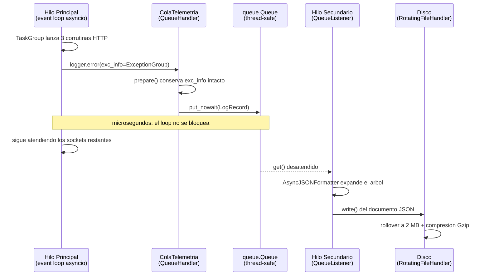

# TritonMonitor — Sistema de Telemetría Multicloud y Observabilidad Asíncrona

> **TP-1 · Unidad 1: Calidad de Software y Observabilidad**
> Programación para Automatización II — 2026
> Formador: Lic. Juárez, Jacobo León

Monitor CLI oficial de **Triton Cloud Services**. Interroga en paralelo los nodos
de telemetría de **AWS, Azure y GCP** mediante peticiones HTTP asíncronas
**reales contra APIs públicas de internet**, resiste latencias extremas y
respuestas corruptas, y persiste cada evento en un volcado JSON estructurado,
rotado y comprimido.

---

## 1. Grupo de trabajo

**Nombre del grupo:** `G10`

| # | Apellido y Nombre | Rol técnico | Módulo bajo su firma |
|---|---|---|---|
| 1 | Gabriel | Ingeniero de Robustez de Entradas y Excepciones | `exceptions.py`, `sanitizer.py` |
| 2 | Hernán | Ingeniero de Concurrencia y Telemetría Asíncrona | `core.py` |
| 3 | Nelson | Ingeniero de Formateo Estructurado JSON | `logging_engine.py` — `AsyncJSONFormatter` |
| 4 | Lorenzo | Ingeniero de Almacenamiento y Desacoplamiento No Bloqueante | `logging_engine.py` — pipeline de cola |
| 5 | Maximiliano | Coordinador de Integración y Flujo CLI | `app_operator.py` |
| 6 | Emilio | Ingeniero de Simulación de Caos y Pruebas Forenses | `tests/` |

> Cada integrante defiende **exclusivamente** el módulo bajo su firma durante el
> video de defensa grupal.

---

## 2. Escenario de producción

La corporación multinacional Triton Cloud Services opera clústeres de cómputo
críticos distribuidos de manera simultánea en tres proveedores de nube. Durante
tormentas de radiación electromagnética, múltiples nodos de telemetría sufren de
forma **paralela** colapsos físicos de red, pérdidas de peering o corrupciones
graves de datos.

El monitor debe sobrevivir a los tres modos de fallo **al mismo tiempo**, sin
cerrarse de forma abrupta y sin perder la evidencia forense de ningún incidente.

---

## 3. Instalación

Requiere **Python 3.12 o superior** (se usan `asyncio.TaskGroup`, `except*` de
PEP 654 y el atributo nativo `taskName` en los registros de logging). Verificado
sobre CPython 3.12 y 3.14.

> En distribuciones Debian/Ubuntu, `python3 -m venv` falla si el paquete del
> módulo `venv` no está instalado. Se resuelve con
> `sudo apt install python3-venv` (o `python3.12-venv` según la versión).

```bash
# 1. Clonar el repositorio
git clone https://github.com/<usuario>/triton_monitor.git
cd triton_monitor

# 2. Crear el entorno virtual aislado
python3 -m venv .venv
source .venv/bin/activate        # En Windows: .venv\Scripts\activate

# 3. Instalar la única dependencia externa
pip install -r requirements.txt

# 4. Verificar la instalación
python3 src/app_operator.py --help
python3 src/app_operator.py --version
```

---

## 4. Uso

```bash
python3 src/app_operator.py PROVEEDOR [PROVEEDOR ...] [opciones]
```

| Parámetro | Descripción | Restricción |
|---|---|---|
| `proveedores` | Nubes a interrogar | `AWS`, `Azure`, `GCP`; los repetidos se colapsan |
| `-c`, `--cluster` | Identificador de clúster | Patrón `cluster-<region>-<numero>` |
| `-t`, `--timeout` | Ventana de espera de red | Flotante en `[0.1, 5.0]` segundos |
| `-m`, `--modo` | Modo operativo | `nominal`, `debug`, `emergency` |
| `--chaos` | Inyección de caos real en caliente | — |
| `--archivo-log` | Ruta del volcado estructurado | Por defecto `triton_services.log` |
| `-v` / `-q` | Verbosidad de consola | Mutuamente excluyentes |
| `--version` | Versión del paquete `triton_telemetry` | Imprime y termina con código `0` |

`-q` suprime **toda** la salida de texto, tanto el reporte de `stdout` como las
notas forenses de `stderr`. El volcado JSON en disco no se ve afectado: viaja
por el pipeline de logging, que es un canal independiente.

---

## 5. Arquitectura de telemetría

Flujo conceptual de las corrutinas asíncronas, el agrupamiento de excepciones
concurrentes, la cola segura en memoria y el formateador recursivo JSON:



### 5.1. Diagrama de flujo de hilos

El aislamiento de I/O es el punto crítico del diseño: el bucle de eventos
**nunca** toca el disco. Solo deposita el registro en una cola sincronizada y
sigue atendiendo sockets.



---

## 6. Estructura del proyecto

```
triton_monitor/
├── src/
│   ├── triton_telemetry/
│   │   ├── __init__.py          # Expone la API pública mediante __all__
│   │   ├── exceptions.py        # Excepciones semánticas (nunca BaseException)
│   │   ├── sanitizer.py         # Validación declarativa con argparse
│   │   ├── core.py              # Consulta asíncrona paralela (asyncio.TaskGroup)
│   │   └── logging_engine.py    # Formateador JSON y pipeline no bloqueante
│   └── app_operator.py          # Punto de entrada CLI (argparse + except*)
├── tests/
│   ├── _comun.py                # Utilidades compartidas por las baterías
│   ├── test_integrante_1.py     # Verificación de exceptions.py y sanitizer.py
│   ├── test_integrante_2.py     # Verificación de core.py
│   ├── test_integrante_3.py     # Verificación de AsyncJSONFormatter
│   ├── test_integrante_4.py     # Verificación del pipeline de cola
│   ├── test_integrante_5.py     # Verificación del CLI y auditoría AST
│   ├── chaos_suite.py           # Suite de simulación de caos
│   └── telemetry_validator.py   # Auditoría forense del JSON y los .gz
├── requirements.txt             # Dependencias aisladas del proyecto
└── README.md
```

---

## 7. Decisiones de diseño

### 7.1. Por qué `TritonError` hereda de `Exception` y no de `BaseException`

Heredar de `BaseException` provocaría que un bloque `except TritonError`
secuestrara señales vitales del sistema operativo como `KeyboardInterrupt`
(`Ctrl+C`), dejando al operador sin capacidad de abortar un proceso desatendido
colgado.

### 7.2. Por qué se recolectan los incidentes antes de agrupar

`asyncio.TaskGroup` **cancela las tareas hermanas ante el primer fallo**, y los
`CancelledError` resultantes son absorbidos por el grupo. En un escenario de
tormenta de radiación eso significaría perder la evidencia de los colapsos
*simultáneos*: el 504 de Azure llega en ~300 ms y cancelaría el timeout de AWS
antes de que se cumplieran los 1.5 s.

Por eso cada corrutina captura su propia excepción **semántica de dominio**
(jamás `BaseException`), la deposita en un acumulador compartido, y al cerrar el
`TaskGroup` se reconstruye un `ExceptionGroup` con la totalidad de los
incidentes. Resultado: los tres bloques `except*` disparan en la misma corrida y
los nodos sanos siguen apareciendo en el reporte.

### 7.3. Por qué `ColaTelemetria` sobreescribe `prepare()`

El `QueueHandler` estándar formatea el registro en el hilo productor y a
continuación **descarta** `exc_info`, `args` y `stack_info`. Ese comportamiento
destruiría el árbol de `ExceptionGroup` que el `AsyncJSONFormatter` necesita
expandir en el hilo consumidor. La subclase trabaja sobre una copia superficial
del registro y conserva la evidencia intacta.

### 7.4. Por qué la deduplicación de proveedores vive en la CLI y no en el núcleo

`core.escanear_proveedores` bautiza cada corrutina como `telemetria-<proveedor>`.
Una invocación como `AWS AWS AWS` crearía tres tareas homónimas: se triplicarían
las peticiones HTTP reales contra el mismo endpoint y el campo `tarea_asyncio`
del volcado JSON dejaría de identificar unívocamente a la corrutina emisora,
que es precisamente la garantía forense que ofrece la sección 10.

La corrección pertenece a la frontera de entrada, no al núcleo: es una
normalización del dato del operador, del mismo orden que el patrón de clúster o
el rango de timeout. Se implementa como una subclase de `argparse.Action`, de
modo que el núcleo asíncrono sigue recibiendo una lista ya saneada y no necesita
defenderse de entradas malformadas.

### 7.5. Por qué existe un cuarto bloque `except*`

Los tres bloques quirúrgicos cubren las familias de incidente conocidas. Si la
jerarquía `TritonError` incorporara una excepción nueva sin tratamiento propio,
su subgrupo saldría vivo del `try` y se relanzaría **después** del `finally`: el
operador recibiría un traceback crudo y el proceso terminaría con el código que
elija el intérprete, descartando el `codigo_salida` semántico que acumula
`main()`.

El bloque `except* TritonError` final captura la raíz de la jerarquía y actúa
como red de seguridad. Va **último** de forma deliberada: declarado antes,
absorbería los subgrupos de las tres familias específicas y ninguno de sus
bloques llegaría a ejecutarse.

---

## 8. Cumplimiento de estándares (HARD GATES)

| Exigencia | Cómo se cumple |
|---|---|
| Prohibido capturar `BaseException` o usar `except: pass` | Toda captura es de una excepción concreta y siempre registra o reporta |
| Prohibido `return`, `break` o `continue` en `finally` | El `finally` de `main()` solo libera recursos; el código de salida se acumula en una variable y se retorna después del bloque |
| Prohibido abrir el mismo archivo de logs varias veces en paralelo | Un único `RotatingFileHandler`, alcanzable solo a través de la cola sincronizada |
| Aislamiento de dependencias | `requirements.txt` con `httpx` |
| Documentación con diagrama Mermaid | Secciones 5 y 5.1 |
| Marca de tiempo ISO 8601 UTC | `datetime.fromtimestamp(..., tz=timezone.utc)` |
| PEP 654 (`except*`) | Tres bloques quirúrgicos independientes en `app_operator.py`, más una red de seguridad `except* TritonError` (sección 7.5) |
| PEP 765 (Python 3.14) | El `finally` no inyecta directivas de control de flujo |

---

## 9. Guía de pruebas de integración

### Escenario A — Operación nominal completa

```bash
python3 src/app_operator.py AWS GCP -c cluster-us-east-01 -t 3.0
```

Las llamadas asíncronas se ejecutan en paralelo. La consola muestra el reporte
nominal con las latencias de red reales obtenidas de JSONPlaceholder.

### Escenario B — Validación temprana de argumentos fallida

```bash
python3 src/app_operator.py AWS GCP -c cluster-invalido-id -t 9.5
```

La aplicación **no inicia el bucle de asyncio ni conecta con internet**.
`argparse` atrapa el `ArgumentTypeError` devuelto por `sanitizer.py`, imprime la
ayuda formal autogenerada y sale con código de retorno `2`.

### Escenario C — Inyección de caos

```bash
python3 src/app_operator.py AWS Azure GCP -c cluster-us-west-02 -t 1.5 --chaos
```

El `TaskGroup` detecta los colapsos paralelos simultáneos y propaga un
`ExceptionGroup` procesado selectivamente por los bloques `except*`. Las notas
inyectadas con `add_note()` se despliegan en la consola de error y se guarda un
volcado estructurado del desastre en `triton_services.log`.

### Escenario D — Silenciamiento total de la consola

```bash
python3 src/app_operator.py AWS Azure GCP -c cluster-us-west-02 --chaos -q
```

No se imprime una sola línea por `stdout` ni por `stderr`, pero el volcado
`triton_services.log` se escribe íntegro: consola y disco son canales
independientes del mismo pipeline.

### Baterías de verificación por integrante

Cada integrante firma una batería que audita exclusivamente su módulo. Todas se
ejecutan sin conexión a internet salvo donde se indique lo contrario:

```bash
python3 tests/test_integrante_1.py   # exceptions.py y sanitizer.py
python3 tests/test_integrante_2.py   # core.py — concurrencia y telemetría
python3 tests/test_integrante_3.py   # AsyncJSONFormatter
python3 tests/test_integrante_4.py   # pipeline de cola no bloqueante
python3 tests/test_integrante_5.py   # CLI, integración y auditoría AST
```

La batería del integrante 5 incluye una **auditoría mecánica por AST**: recorre
el árbol de sintaxis de todos los módulos de `src/` y demuestra que ninguna
prohibición de la cátedra fue violada, sin depender de la lectura humana del
código.

### Suite de caos y auditoría forense

```bash
python3 tests/chaos_suite.py
python3 tests/telemetry_validator.py
```

---

## 10. Formato de la telemetría

Cada línea del volcado es un documento JSON independiente (*JSON Lines*):

```json
{
  "timestamp": "2026-08-29T16:26:40.436Z",
  "nivel": "INFO",
  "servicio": "triton-monitor",
  "logger": "triton.operator",
  "mensaje": "Nodo de telemetría operativo",
  "proceso": { "pid": 657, "nombre": "MainProcess" },
  "hilo": { "id": 140265893507200, "nombre": "MainThread" },
  "tarea_asyncio": "telemetria-AWS",
  "origen": { "modulo": "core", "funcion": "consultar_proveedor", "linea": 133 },
  "contexto": { "proveedor": "AWS", "latencia_ms": 42.66, "codigo_estado": 200 }
}
```

Ante un incidente se agrega el nodo `excepcion`, con el árbol completo:
sub-excepciones del `ExceptionGroup`, causas raíz encadenadas con `from`,
evidencia HTTP de `httpx` (verbo, URL, código de estado, cuerpo del servidor) y
las notas dinámicas de `add_note()`.
